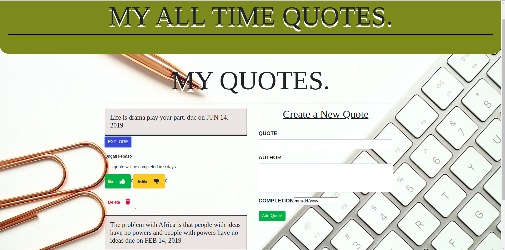

## Project name.
- Quotes.

## Project description.
- The website is basically a website that one can upload quotes and he or she can like and dislike the qoute or upvote or downvote.

## Author information.
 - Dennis Mwaniki
 
## Setup instructions 
Open terminal (CTRL ALT T)
git clone https://github.com/dennismwaniki67/angular1.git
cd quotes-app
use atom . or code . to open the cloned repo on Atom or Vs-code respectively

## Technology Used
 - HTML-We used html for displaying the content.
 - CSS-We used css and bootstrap for styling the front-end of the website and making the landing page.
 - Angular-

## BDD.
 
 -In the form we have the authors input and the quotes input and also you can upvote and downvote the project.When one put a quote it must desplay when submitted and indicate the time it has been posted.
 
## Development Process
 - To fix a bug or enhance an existing module, follow these steps:
 - Fork the repo
 - Create a new branch (git checkout -b improve-feature)
 - Make the appropriate changes in the files
 - Add changes to reflect the changes made
 - Commit your changes (git commit -am 'Improve feature')
 - Push to the branch (git push origin improve-feature)
 - Create a Pull Request
## Project's live Link

 - https://dennismwaniki67.github.io/angular1/
 ## codebeatlink

## Contact information.
 - Email: dennismwaniki67@gmail.com.
 - Phone-No: 0729994042.
## License and Copyright information.
 - MIT License Copyright (c) 2019 (Dennis Mwaniki)
 - - 
